# Shambomon
**Collaborators**: Matt Dang, Kimberly Nguyen 

**Shambomon**: http://shambomon.kimberlynguyen.solutions 

**Course Website**: http://www.ccs.neu.edu/home/ntuck/courses/2018/01/cs4550/ 

## Introduction 
Shambomon is a two-player game inspired by the two classics: [Roshambo](https://en.wikipedia.org/wiki/Rock–paper–scissors) (more 
commonly known as "Rock-Paper-Scissors") and [Pokémon](https://en.wikipedia.org/wiki/Pokémon). Each player starts off 
with 100 health points (HP), and the goal of the game is to be the first to 
bring your opponent's HP to 0. 

## Creating a Game 
When users first visit the home page, they will be prompted with a log-in form. 
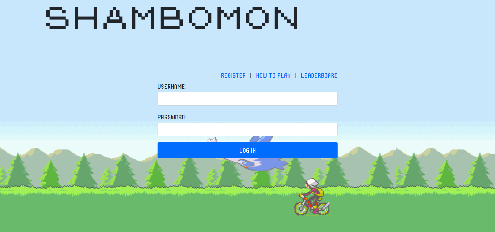 

Users can use the "How to Play" link to open the help pages and learn how to 
play. 
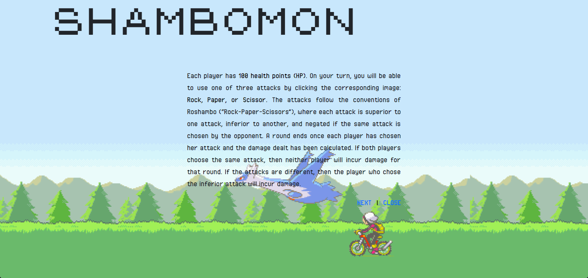 
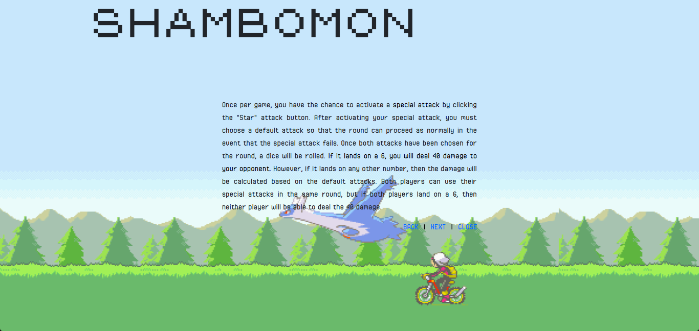 
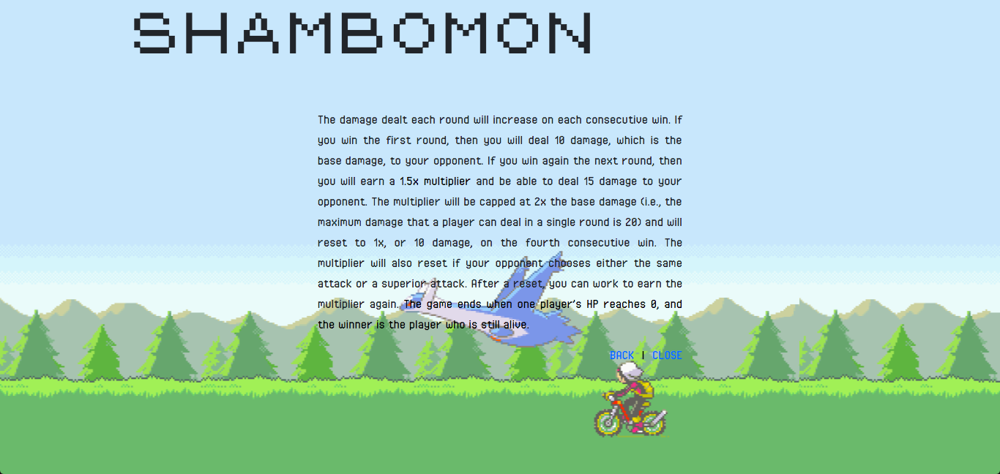 

If users do not have an account, they can use the "Register" link to create one. 
This link will redirect them to a registration form. 
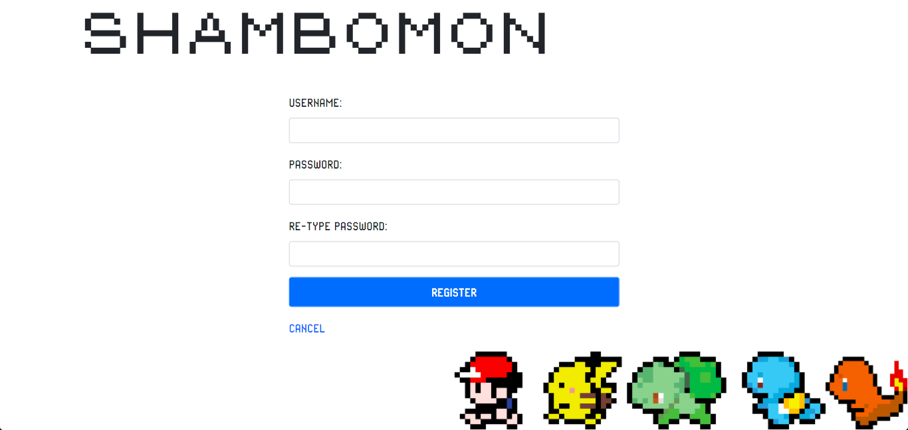 

After logging in, users will be prompted for a game name. Two users who enter 
the same game name will be placed in the same game to play against each other. 
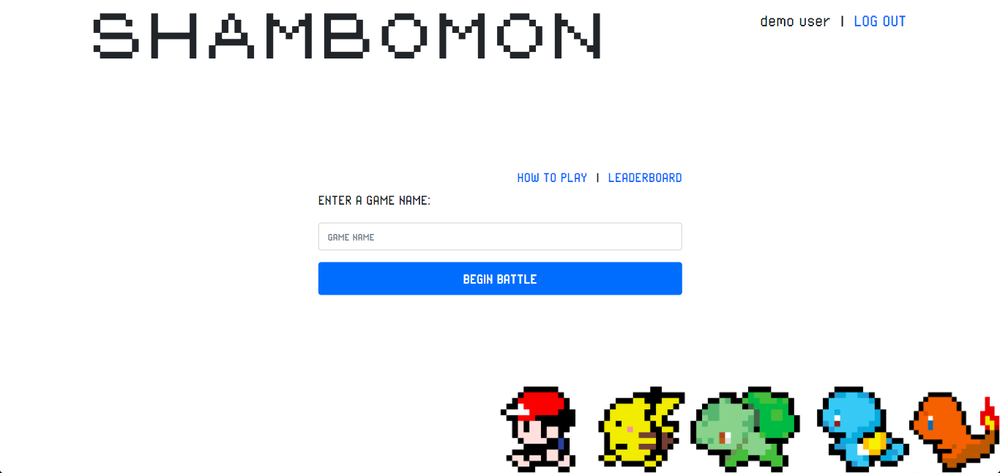 

There are 12 different Pokémon to choose from. 
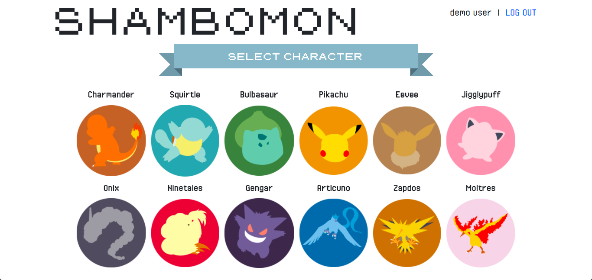 

If the room does not have two players yet, users will see a "Waiting" message 
after selecting their Pokémon. 
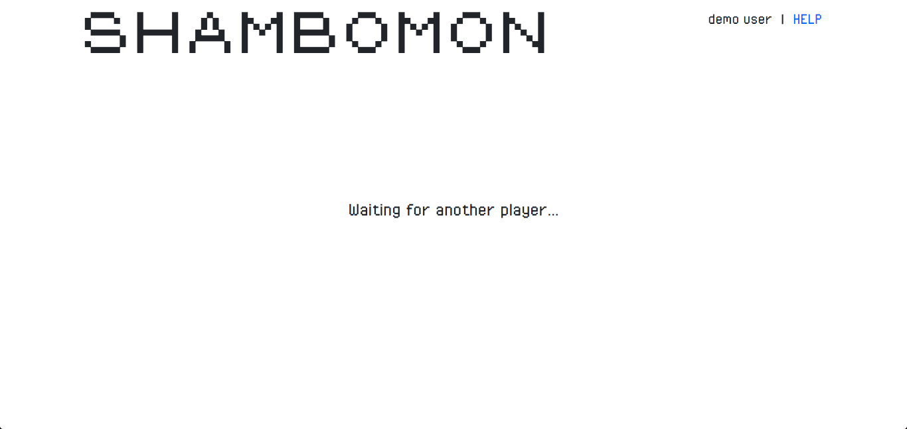 

## Gameplay 
Once a second player joins, the battlefield will be rendered. 
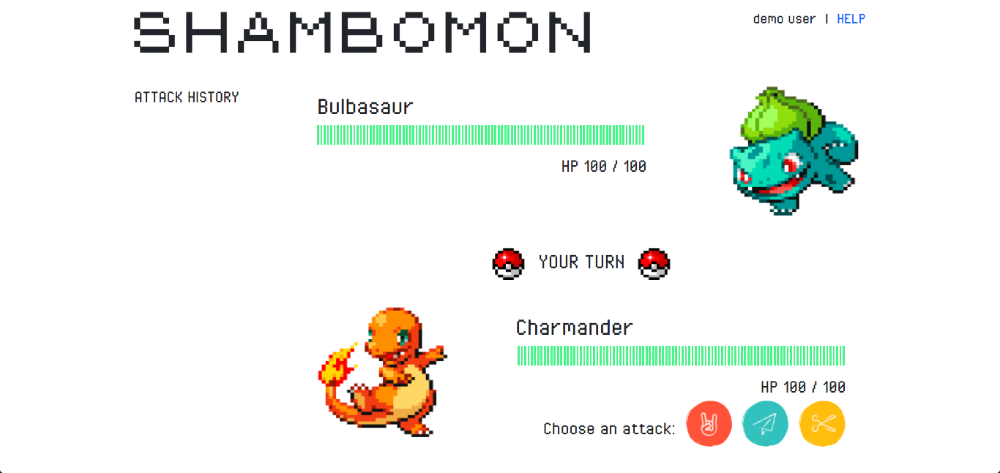 

Players take turns playing multiple rounds of Roshambo, using the attack buttons 
in the bottom-right. The HP bars will change color as a player's HP goes down. 
The sidebar to the left records the attacks chosen and damage taken for each 
round. 
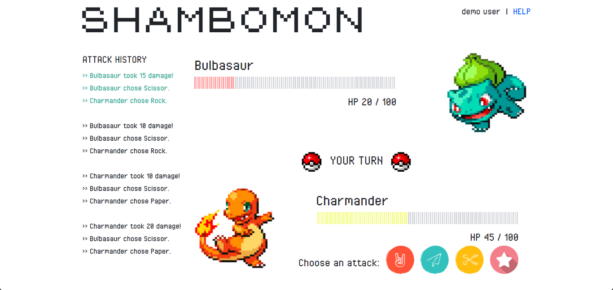 

Once per game, players can activate their special attack by clicking the "Star" 
attack button. Upon doing so, they will be asked to choose a default attack. If 
the attack is successful, the player will be able to deal 40 damage to her 
opponent. 
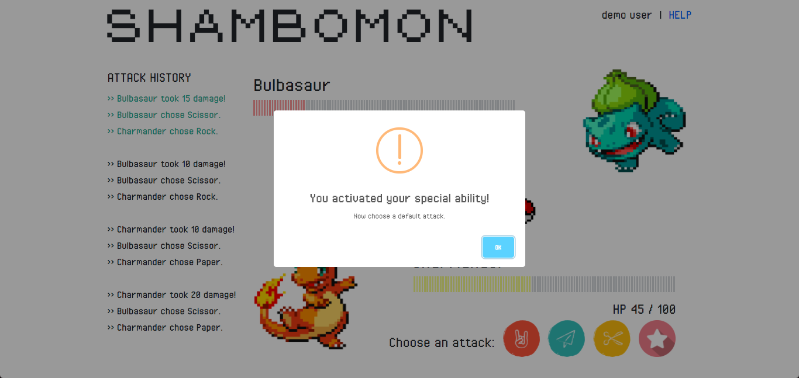 

The message in the middle indicates whose turn it is. If users try to join a 
game that is already full, the message will indicate that they are spectating. 
Spectators can watch the game in real-time but are not allowed to play. 
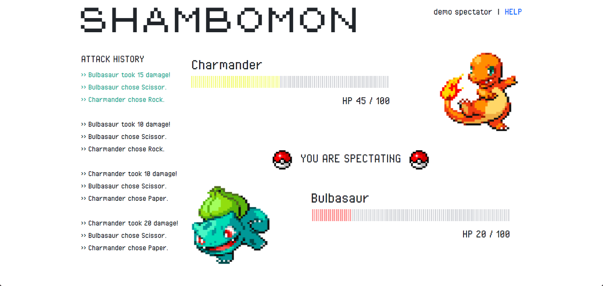 

Players can use the "Help" link in the top-right to toggle the help pages. 
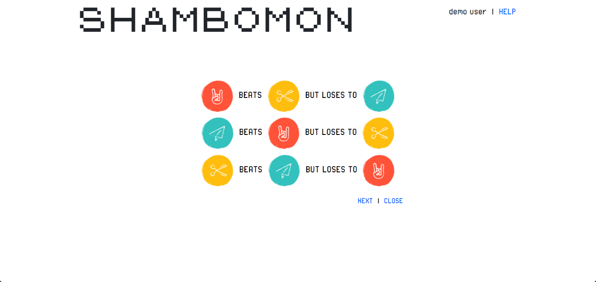 
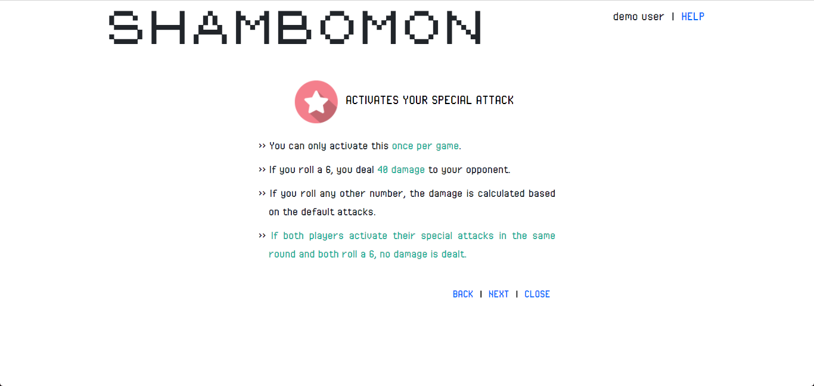 
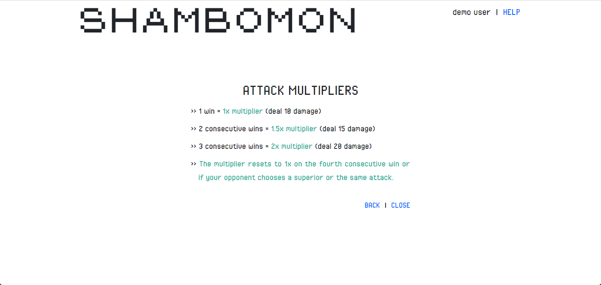 

Once the game ends, players will see a message indicating whether or not they 
have won. 
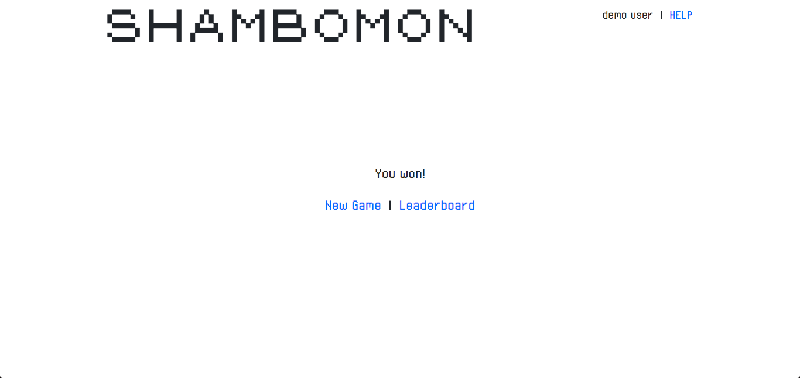 

## Leaderboard 
Users' stats will be recorded in a leaderboard after each game. Here, they can 
view their ranks and win ratios compared to those of other users. 
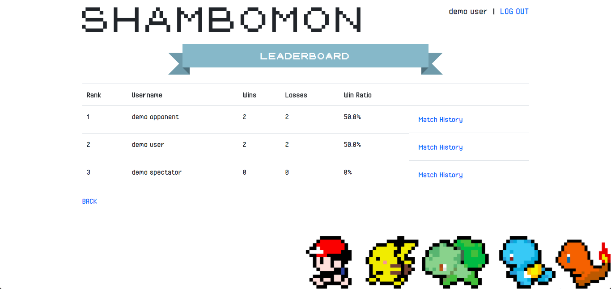 

Users can also view details about individual matches by using the "Match 
History" link. Victories are highlighted in blue, while defeats are highlighted 
in pink. 
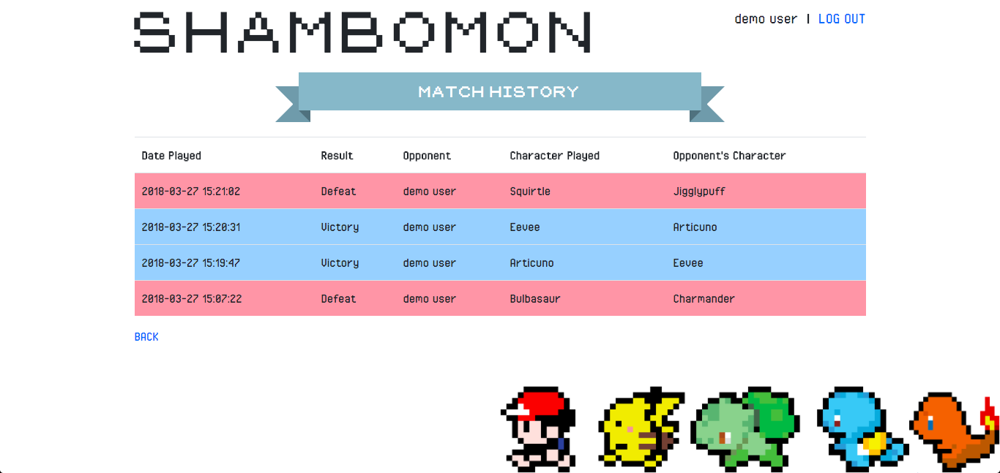 

Have fun playing!