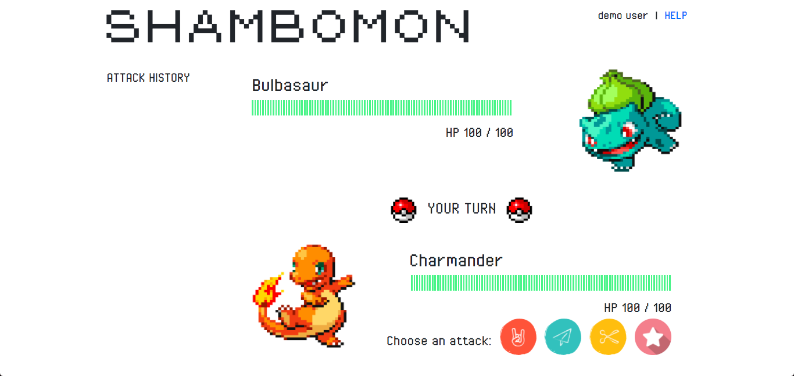

# Shambomon
**Collaborators**: Matt Dang, Kimberly Nguyen 

**Shambomon**: http://shambomon.kimberlynguyen.solutions

**Course Website**: http://www.ccs.neu.edu/home/ntuck/courses/2018/01/cs4550/

================================================================================
## Introduction
================================================================================
Shambomon is a two-player game inspired by the two classics: Roshambo (more 
commonly known as "Rock-Paper-Scissors") and Pokémon. Each player starts off 
with 100 health points (HP), and the goal of the game is to be the first to 
bring your opponent's HP to 0.

================================================================================
## Creating a Game
================================================================================
When users first visit the home page, they will be prompted with a log-in form. 
 

Users can use the "Help" link to open the help pages and learn how to play. 
 
 

If users do not have an account yet, they can use the "Registration" link to 
create one. This will redirect them to a registration form. 
 

After logging in, users will be prompted for a game name. Two users who enter 
the same game name will be placed in the same game to play against each other. 
 

There are 12 different Pokémon to choose from. 
 

If the room does not have two players yet, users will see a "Waiting" message. 
 

================================================================================
## Gameplay
================================================================================
Once a second player joins, the battlefield will be rendered. 
 

Players take turns playing multiple rounds of Roshambo using the attack buttons 
below their character. The HP bars will change color as a player's HP goes down. 
The sidebar to the left records the attacks chosen and damage taken for each 
round. 
 

The message in the middle indicates whose turn it is. If users try to join a 
game that is already full, the message will indicate that they are spectating. 
Spectators can watch the game in real-time but are not allowed to play. 
 

Players can use the "Help" link in the top-right to toggle the help pages. 
 
 

Once the game ends, players will see a message indicating whether or not they 
have won. 
 